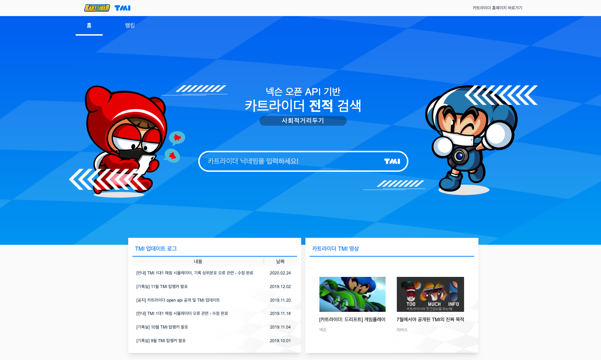
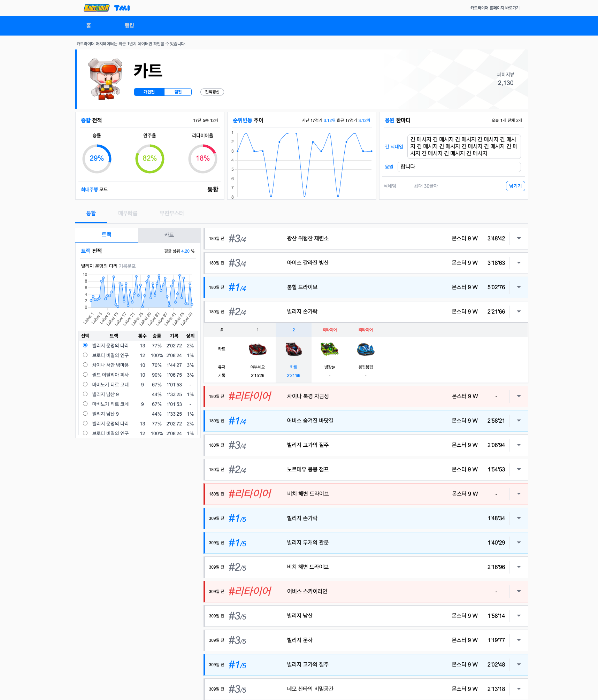
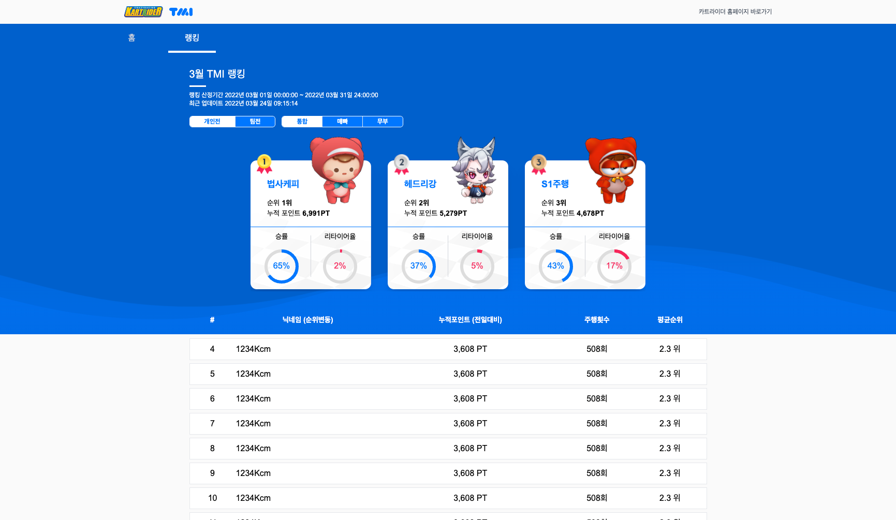
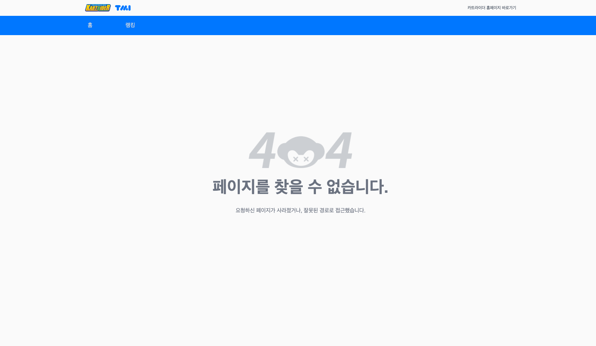

# 카트라이더 전적 검색 TMI <!-- omit in toc -->

>[배포 사이트 바로가기](https://wanted-codestates-project-2.netlify.app)

[카트라이더 전적 검색 TMI](https://tmi.nexon.com/kart) 사이트를 클론코딩했습니다.

## 목차 <!-- omit in toc -->

- [기술 스택](#기술-스택)
- [실행 방법](#실행-방법)
- [프로젝트 구조](#프로젝트-구조)
- [구현 페이지](#구현-페이지)
  - [메인 페이지](#메인-페이지)
  - [개인 전적 조회 페이지](#개인-전적-조회-페이지)
  - [랭킹 페이지](#랭킹-페이지)
  - [NotFound 페이지](#notfound-페이지)
- [구현 기능](#구현-기능)
- [트러블슈팅](#트러블슈팅)

## 기술 스택

- [Vue3](https://vuejs.org/) (Composition API)
- [Vue Router](https://router.vuejs.org/)
- [Chart.js](https://www.chartjs.org/)
- [Tailwind CSS](https://tailwindcss.com/)
- [TypeScript](https://www.typescriptlang.org/)
- [Netlify](https://www.netlify.com/)
- [Netlify Functions](https://docs.netlify.com/functions/overview/)
- [ESLint](https://eslint.org/)

## 실행 방법

1. 원격 저장소를 클론합니다.

   ```sh
   $ git clone https://github.com/jinyongp/wanted-codestates-project-2.git
   ```

2. 의존성 패키지를 설치합니다. 먼저 [`yarn`](https://yarnpkg.com/)이 설치되어 있어야 합니다.

   ```sh
   $ yarn
   ```

3. 개발 서버를 시작합니다. Netlify functions를 실행하기 위해선 [netlify-cli](https://docs.netlify.com/cli/get-started/)를 설치해야 합니다.

   ```sh
   $ netlify dev
   ```

## 프로젝트 구조

```
.
├── public
│
├── netlify
│   ├── constants
│   ├── data
│   ├── functions
│   ├── types
│   └── utils
│
└── src
    │
    ├── components
    │   ├── home
    │   ├── rank
    │   ├── shared
    │   ├── track
    │   └── user
    │
    ├── assets
    ├── constants
    ├── router
    ├── store
    ├── styles
    ├── types
    └── views
```

## 구현 페이지

### 메인 페이지



### 개인 전적 조회 페이지



### 랭킹 페이지



### NotFound 페이지



## 구현 기능

- [TailwindCSS를 활용해 반응형 디자인](https://tailwindcss.com/docs/responsive-design)을 적용했습니다.

- TailwindCSS 기능을 활용해 [custom keyframe](tailwind.config.js#L23)을 구현했습니다.

  - `wave`, `swell`: 랭킹 페이지의 배경의 웨이브 효과를 적용합니다.
  - `shake`: 좌우로 흔들리는 애니메이션 효과를 적용합니다.

- Vue의 [Transition](https://vuejs.org/guide/built-ins/transition.html) 기능을 활용해 애니메이션을 구현했습니다.

  - [HomeView](src/views/HomeView.vue)에서 페이지 진입 시 캐릭터와 배경 이동 및 검색창 애니메이션
  - [RankView](src/views/RankView.vue)에서 페이지 진입 시 랭크보드 fade in 애니메이션
  - [SearchArea](src/components/home/SearchArea.vue)에서 `<라이더명>와 일치하는 라이더가 없습니다.`라는 안내 메시지 shake & fade in/out 애니메이션
  - [CircleProgress](src/components/shared/CircleProgress.vue)에서 원형 진행바가 채워지는 애니메이션

- [TabNavigation](src/components/shared/TabNavigation.vue) 컴포넌트에서 탭에 마우스를 올려두었을 때, [동적인 underline 효과](src/tailwind.css#L33)를 적용했습니다. Hover 시 왼편에서 시작하고 오른편으로 종료됩니다.

- [LoadingIndicator](src/components/shared/LoadingIndicator.vue) 컴포넌트를 구현하여 네트워크 요청에서 로딩 중임을 알려줍니다. TailwindCSS에서 기본 제공되는 `animate-spin`을 이용했습니다.

- Chart.js를 이용하여 LineChart를 구현했습니다. [RankChartBoard.vue](src/components/user/RankChartBoard.vue#L86), [TrackRecordBoard.vue](src/components/user/TrackRecordBoard.vue#L58)

- 기존 사이트에선 클릭할 수 있는 요소를 클릭할 때, 버튼 그 자체가 아닌 텍스트만 클릭할 수 있도록 구현된 부분이 많았습니다. 그러한 부분이 불편하다 여겨졌고, 텍스트만이 아닌 버튼을 클릭하면 동작하게끔 수정하였습니다. (e.g. 내비게이션 탭 버튼)

- 기본 사이트에서 개인 전적 조회 페이지의 트랙 전적 테이블 컴포넌트가 스크롤을 내리면 보이지 않는다는 점이 불편했습니다. [sticky 스타일](src/views/UserView.vue#L36)을 적용하여 스크롤을 내릴 때 좌측에 고정될 수 있도록 하였습니다. 또한, 랭킹 페이지에서 랭킹 테이블의 헤더 부분 또한 [sticky 스타일](src/components/rank/RankTable.vue#L9)을 적용하여 뷰포트에서 항상 보이도록 하였습니다.

- [Netlify Functions](https://docs.netlify.com/functions/overview/)를 이용한 Serverless를 구축했습니다. 기존의 API 응답 데이터를 재가공하여 반환합니다.

  -  [`get-user-id`](netlify/functions/get-user-id.ts): 유저 이름을 받아 해당 유저의 아이디를 반환합니다. 검색 시 사용자의 존재 여부를 확인하는 용도와 사용자 아이디를 얻는 용도로 활용했습니다.
  -  [`get-user-info`](netlify/functions/get-user-info.ts): 사용자의 정보 및 최근 전적 정보를 반환합니다. 승률, 완주율 그리고 리타이어율과 전적를 확인할 수 있으며, chart.js를 위한 데이터를 제공합니다.
  -  [`get-match-details`](netlify/functions/get-match-details.ts): 매치 아이디를 받아 해당 매치의 자세한 정보를 반환합니다. 순위 순서대로 나열된 배열을 응답합니다.

- Functions의 엔드포인트인 `/.netlify/functions`는 사용하기에 지저분하여 [`public/_redirects`](public/_redirects) 파일을 통해 `/api`로 리다이렉트하도록 했습니다. DevTools의 Network 탭에서 확인해본 결과, `/.netlify/functions`에 접근하는 대신 `/api`에 접근하여 요청 가능하도록 변경되었습니다.

- 다양한 [utils](netlify/utils) 함수를 구현했습니다.

  - [axios.ts](netlify/utils/axios.ts): axios 인스턴스를 생성합니다. headers에 API 키를 등록했습니다.
  - [case-converter.ts](netlify/utils/case-converter.ts): Case Naming Convention에 따라 변환할 수 있는 함수 집합입니다.
  - [error-handler.ts](netlify/utils/error-handler.ts): netlify functions에서 이용하는 handler의 에러를 처리합니다.
  - [format.ts](netlify/utils/format.ts): format 관련 함수 집합입니다.
  - [resource.ts](netlify/utils/resource.ts): hash 값으로부터 대응하는 정적 데이터를 가져옵니다.
  - [time.ts](netlify/utils/time.ts): 시간 변환 관련 함수 집합입니다.

## 트러블슈팅

- Open API CORS 문제와 API 키 노출 문제

제공된 Open API를 이용할 때, 로컬 환경과 배포 환경에서 CORS 에러를 겪었습니다. 개발 환경에서는 Webpack에서 제공하는 proxy 기능을 이용했으나, 배포 환경에서는 별도의 proxy 서버를 구축해주어야만 했습니다. 그 와중에 netlify에서 제공하는 functions 기능을 발견하였고, 이를 이용하여 proxy 서버를 구축하기로 했습니다.

결과적으로 Functions 기능을 이용해 배포 환경에서 CORS 문제를 해결함과 동시에 function 내부에서 서버로부터 전달 받은 데이터를 재가공하여 클라이언트에게 전달해주는 방식으로 클라이언트가 연산해야 하는 부담을 줄이고 역할을 분리함으로써 더 깔끔한 코드를 작성할 수 있었습니다.

또한, 브라우저에서 Open API에 요청할 때 DevTools의 Network 탭에서 해당 요청의 headers를 확인해보면 그대로 API 키가 노출되는 문제가 있었는데, 이를 proxy 서버가 대신 해주니 노출되지 않아 보안 면에서도 문제를 해결할 수 있었습니다. (Proxy 서버 API는 동일 출처에서만 호출 가능합니다.)

- Netlify Redirects 문제

Netlify functions 엔드포인트 리다이렉트를 위해 [`netlify.toml`](netlify.toml) 파일에서 설정을 해주었으나, 제대로 동작하지 않는 문제가 있었습니다. [공식 문서 확인 결과](https://docs.netlify.com/get-started/#redirect-a-path) `_redirects` 파일을 이용해야 했으며, 루트 폴더가 아닌 `public` 폴더 내에 위치시켜야만 동작했습니다.

또한, 공식 문서에는 없지만 status를 200으로 설정해주지 않으면 304 리다이렉션과 함께 두 번 요청하는 문제가 있었습니다. status를 200으로 지정해주어 한 번만 요청할 수 있도록 문제를 수정했습니다.

- Axios Error Handling

`try...catch`에서 얻은 `error` 객체는 `any`이므로 AxiosError인지 먼저 확인해보아야 했습니다. 검색 결과 `axios.isAxiosError(error)`라는 [`TypeGuard`](https://www.typescriptlang.org/docs/handbook/2/narrowing.html#using-type-predicates) 함수를 제공하고 있었고 이를 통해 AxiosError 타입인지 확인할 수 있었습니다.

- [protectHandler](netlify/utils/error-handler.ts) 구현

Netlify functions인 `handler`에서 axios를 사용하기 위해 매번 `try...catch`를 작성해야 했습니다. `AxiosError`와 `InternalServerError` 처리를 위해 반복적으로 작성해야 했으므로 이를 하나로 통합하기 위해 [`protectHandler`](netlify/utils/error-handler.ts)를 구현했습니다.

`protectHandler`는 `handler`를 인자로 받아 그 내부에서 발생한 에러를 대신 잡아내고 분기하여 처리합니다. 덕분에 `handler`를 작성할 때마다 에러 처리에 고민할 필요 없이 `protectHandler`에서 에러를 일괄 처리해주므로 `handler`마다 `try...catch`를 작성해야 하는 반복적인 작업을 없앨 수 있었습니다. 에러 전달 과정을 나타내면 다음과 같습니다.

    1. handler에서 에러가 발생합니다.
    2. try...catch가 없으므로 에러가 호출자인 protectHandler에게 전달됩니다.
    3. protectHandler의 try...catch에 의해 잡은 에러를 분류하여 그에 맞는 결과를 반환합니다.

- Ranking 페이지 데이터 제한 문제

Rank 페이지가 필요로 하는 모든 데이터를 수집하기 위해선 굉장히 많은 수의 API 요청이 필요했습니다. 하지만, 주어진 API로 그 많은 요청을 수행하면 `Too many request` 에러가 발생하므로 진행하지 못하였습니다. 대신, 요구조건에 가장 부합하는 애니메이션과 반응형 디자인에 주력했습니다.

- CssMinimizerWebpackPlugin 문제

빌드 시 Vue에 기본으로 포함되어 있는 CssMinimizerWebpackPlugin가 최적화하는 과정에서 알 수 없는 에러가 발생했습니다. 원인을 파악해보려고 했으나 찾지 못하여 [webpack 설정에서 비활성화](vue.config.js#L15)하고 이를 대신할 수 있는 [PostCSS 플러그인인 cssnano 라이브러리](postcss.config.js#L7)을 적용하여 최적화했습니다.

- Chart.js 번들 사이즈 문제

Chart.js의 경우 그 자체로 번들 사이즈가 꽤 크다는 문제가 있었습니다. Tree-shaking을 지원하여 번들링 사이즈를 줄이고 있지만, 조금 더 줄이고자 [Dynamic Import를 이용해 Code splitting을 적용했습니다.](src/App.vue#L9) 사전에 Chart 관련 코드를 미리 로드해두고 이후 컴포넌트에서 이용만 하면 되므로 번들 사이즈를 줄이고 성능을 향상시킬 수 있었습니다.
